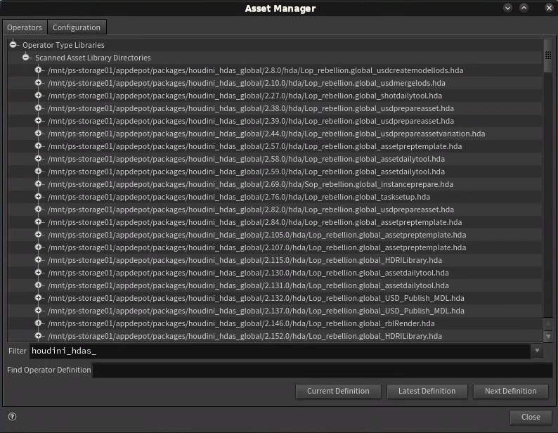
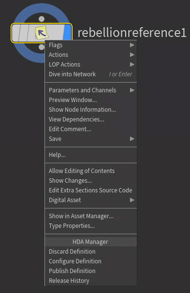
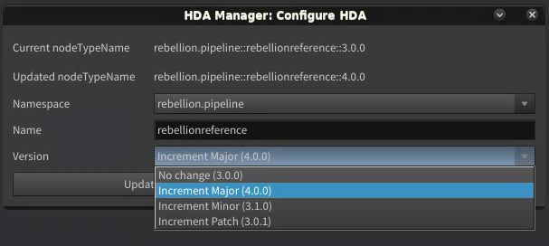
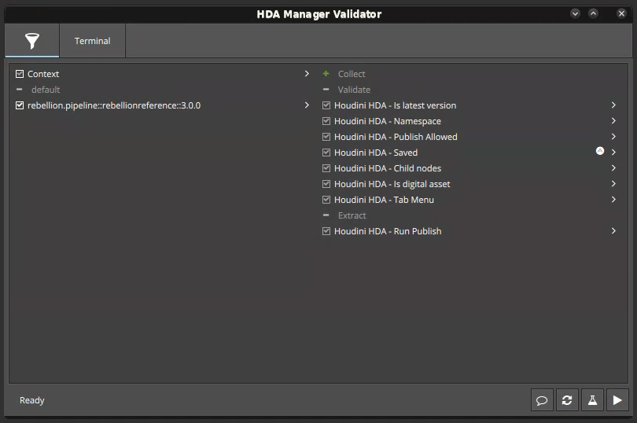
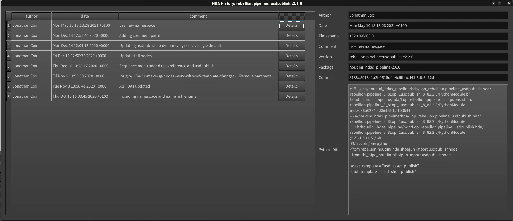

# Loaded HDAs
The HDA Manager loads all HDAs that are contained within the HDA repositories that are loaded in the current environment. These HDAs are all write protected, so any changes that are made to them within Houdini will not be able to be saved.  These HDAs can be accessed and used in the same way as all Houdini nodes using the tab menu.

It is possible to use the built in Asset Manager to display a list of all the HDAs that have been loaded by the HDA Manager:
- Open the Houdini asset manager by selecting it in the menu - `Asset > Asset Manager...`.
- Add a filter of `houdini_hdas_` to isolate all of the Houdini HDA packages, or isolate a specific package ie, `houdini_hdas_pipeline`.

# HDA Manager Menu
The HDA Manager adds a menu to the UI which presents all of it options to the user.

# Making and Discarding Edits
From the point of view of the HDA Manager a HDA can be in one of three different states:
1. HDA not loaded by HDA maanger,
1. HDA loaded by HDA manager.
1. HDA made editable by the HDA manager.

If a Houdini node is using a HDA that falls into one of the first two catergories above than it will need to be made editable before continuing. This is done by selecting `Edit with HDA Manager` from the HDA manager menu. Doing this takes a copy of the HDA and places it within the HDA Manager directory in the current users preferences. Once this is done it can be edited as requrired.

If a node has already beed made editable by the HDA Manager (ie. option three from above), then those edits can be discarded in order to revert to the published version. This is done by selecting `Discard Definition` from the HDA Manager menu.

# Configuring the Definition
A HDA definition that is in an editable state can be configured by selecting `Configure Defintion` from the HDA Manager menu. This allows the following aspects of the Node Type Name to be configured:
- Namespace
- Name
- Version

These three components are used together to automatically generate the Node Type Name and filename that are used for the HDA by the HDA Manager.

For example, the settings below will result in a Node Type Name of `rebellion.pipeline::rebellionreference::3.0.0`, and a file name of `Lop_rebellion.pipeline_rebellionreference.hda`:
- Namespace = rebellion.pipeline
- Name = rebellionreference
- Version = 3.0.0

The definition is configured using a custom UI that shows how the Node Type will be updated:

- The namespace field shows a menu of all available namespaces currently available to the HDA Manager. This will depend on the HDA packages that are added to the current environment.
- The name field is a simple text field which will show the current name which can then be edited as desired.
- The version field shows a menu of the different version changes that can be made:
  - No change
  - Increment Major Version (x.0.0)
  - Increment Minor Version (0.x.0)
  - Increment Patch Version (0.0.x)

Notes:
- Making changes to any part of the Node Type Name will require for scenes that use the HDA to be updated in order to make use of the updates. This can be positive or negative. In a way its negative that it can mean lots of updates to scenes / setups whenever HDA updates are made. The positive is that this means that an HDA update shouldn't result in breaking old scenes / working setups.

# Publishing the Defintion
Once an HDA has been edited and any Note Type configuration changes have been made we can launch the publishing process. This process is launched by selecting the `Publish Definition` option from the HDA Manager menu. This will run through the following steps of the publish:

- Pyblish validation - This must be completed before the publish will take place.
- Publish Comment - The user will be prompted for a comment on what has been edited.
- Publish - The publish will run and a dialog will be displayed on completion. Once it completes the Houdini session will be updated, with the editable version of the HDA being backed up and unistalled along with the newly released version being installed.

Notes:
- For the updated HDA to be available to other users they will need to start a new Houidini session.

# Pyblish Validation
As mentioned above, the HDA manager validates the HDA being published during the publish process. The validation UI will appear which will take the selected Node Type Definition and validate it against any available validation plugins.  The validate button at the bottom right-hand corner of the Pyblish UI will run the validation alone, and the publish button next to it will run validation, and then continue with the HDA publish if it passes. 

The following validation plugins are currently available:
- Saved - Is the definition saved.
- Namespace - Is the namespace that is used valid.
- Tab menu - Has a valid tab menu been set - ie. not "Digital Assets". The tab menu can be set in Type Properties > Interactive > Contex
- Is digital asset? - Is the node we are attempting to publish a digital asset.
- Publish allowed - Is publish allowed in the current session.

# Release History
The release history of any HDA within the HDA manager can be displayed from within Houdini.

This can be useful for:
- Debugging issues, when was the node last updated?
- Something broke, what changed?
- Determining the person largely responsible for a particular NodeType

The history UI is accessible from the network editor right click menu under the Release History option.

This will bring up a UI with details of all of the updates to the selected Node Type. The full history can be viewed by clicking on the Details button.

